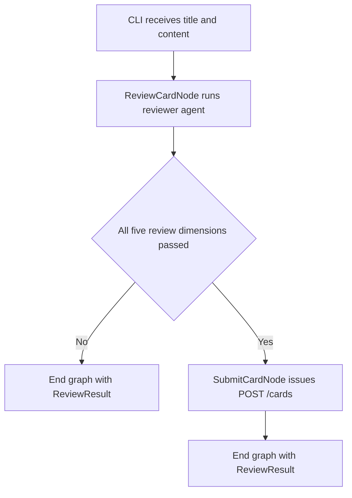

# Design: cli-review-orchestration

## Active Truth Policy
- Keep only currently accepted decisions in this active document.
- Remove superseded decisions instead of keeping deprecation narratives.
- If decision status is unclear, require clarification before finalizing updates.

## Context
- **Purpose:** Define the accepted internal design for how `apps/cli` performs local review of a single knowledge card, models the result, and branches into submission only after a pass.
- **Scope/Boundaries:** Covers typed review schemas, reviewer-agent constraints, graph nodes, graph state, graph dependencies, and internal failure semantics. Excludes external CLI contract, end-user invocation examples, backend ingestion worker behavior, and direct database access.
- **Related Requirements:** R-001, R-002, R-004, R-005, R-006.

## Constraint Projection
- **Governing Constraints:** Repository governance stays unified, authoritative service interfaces remain single-sourced, module boundaries stay explicit, runtime behavior remains reproducible, and spec truth remains synchronized with accepted behavior.
- **Detail Commitments:** Internal review uses one `Pydantic AI` reviewer agent with typed `output_type`, and one thin `Pydantic Graph` workflow with explicit state and dependency injection. Review evaluates only the current `title` and `content`, uses no memory, no retrieval, and no rewrite generation, and returns a fixed five-dimension result.
- **Update Rule:** Requirement-level constraints remain stable while this design document captures internal orchestration, model structure, graph topology, and agent constraints. External command-surface changes are projected into `cli.md`.

## Inputs & Outputs
- **Inputs:**
  - Internal review request data:
    - `title`
    - `content`
  - Injected runtime dependencies:
    - reviewer agent
    - submission callable
- **Outputs:**
  - A typed `ReviewResult`
  - A graph end state that either stops after rejection or stops after submission issuance
  - A CLI-local serialized response that emits only `result=passed` on success, or `result=failed` plus failed dimensions with fixed hints
- **Artifacts:**
  - `ReviewItem`
  - `ReviewResult`
  - `ReviewState`
  - `CliDeps`
  - `ReviewCardNode`
  - `SubmitCardNode`

## Design Approach
- **Approach:** Keep judgment inside a single reviewer agent and keep orchestration inside a minimal graph. The graph exists only to make the internal state transition from review to submission explicit and testable.
- **Diagram syntax rule:** Mermaid flowchart node labels use quoted text inside the node shape delimiters. This is the safe default for labels that may contain troublesome characters such as parentheses, slashes, or punctuation. If a literal double quote is needed inside node text, use an entity code such as `#quot;`.
- **Key Elements:**
  - **Strict model base:** Every internal `BaseModel` uses strict validation, forbids extra fields, and strips surrounding whitespace from string fields.
  - **Schema-driven review semantics:** The review constraints live in the `description` metadata on `ReviewResult` fields. The reviewer prompt stays minimal and relies on the output schema for dimension semantics.
  - **Local failure serialization:** The CLI adds `hint` only after review completes. Hints are not generated by the reviewer agent; they are derived locally from the corresponding `ReviewResult` field descriptions and attached only to failed dimensions. Successful dimensions are omitted from stdout entirely, and success emits only the fixed English result marker `passed`.
  - **`ReviewItem`:** Contains:
    - `passed: bool`
    - `reason: str | None`
    - `reason` may be `null` when `passed=true`.
    - A validator enforces that `reason` is present and non-empty when `passed=false`.
  - **`ReviewResult`:** Contains exactly:
    - `title_validity`
    - `title_content_alignment`
    - `content_coherence`
    - `content_atomicity`
    - `content_latex_validity`
  - **Reviewer-agent rule:** The reviewer agent:
    - receives only current `title` and `content`
    - uses no memory system
    - uses no external context retrieval
    - uses no tool calls
    - returns only the typed `ReviewResult`
  - **`ReviewState`:** Stores:
    - `title: str`
    - `content: str`
    - `review: ReviewResult | None`
  - **`CliDeps`:** Stores:
    - `reviewer_agent`
    - `submit_card`
  - **`ReviewCardNode`:**
    - reads `ctx.state.title` and `ctx.state.content`
    - calls `ctx.deps.reviewer_agent`
    - stores the returned `ReviewResult` in `ctx.state.review`
    - returns `End[ReviewResult]` when any dimension fails
    - returns `SubmitCardNode()` when all dimensions pass
  - **`SubmitCardNode`:**
    - reads `ctx.state.title`, `ctx.state.content`, and `ctx.state.review`
    - calls `ctx.deps.submit_card`
    - returns `End[ReviewResult]`
  - **Graph context:** Node execution receives `GraphRunContext[ReviewState, CliDeps]`, exposing:
    - `ctx.state`
    - `ctx.deps`
- **Interactions:**
  1. The graph starts with `ReviewCardNode`.
  2. `ReviewCardNode` runs the reviewer agent and validates the structured result into `ReviewResult`.
  3. If any review dimension has `passed=false`, the graph ends immediately with that `ReviewResult`.
  4. If all dimensions pass, the graph transitions to `SubmitCardNode`.
  5. `SubmitCardNode` issues the authoritative `POST /cards` submission call and ends with the same `ReviewResult`.
  6. The CLI serializes the `ReviewResult` into stdout JSON and emits only `result=passed` on success, or `result=failed` plus per-field fixed hints only for failed dimensions.

## Mermaid Flow

## Review Semantics
- Review is `all-or-nothing`.
- The five dimensions mean:
  - **`title_validity`:** the title is unambiguous, precisely scoped, and independently understandable without requiring additional context.
  - **`title_content_alignment`:** the title provides an accurate and sufficient indication of the content's topic.
  - **`content_coherence`:** the content is self-contained and self-explanatory given standard domain terminology, without implicit assumptions, missing context, or hidden dependencies.
  - **`content_atomicity`:** the content represents exactly one indivisible knowledge unit and cannot be meaningfully decomposed into smaller independent units.
  - **`content_latex_validity`:** LaTeX expressions in the content, if any, use standard and syntactically correct LaTeX math delimiters and notation. Inline math must use `\(` and `\)`, and display math must use `\[` and `\]`; `$` and `$$` delimiters are rejected.

## Validation
- **Checks:**
  - Spec review confirms this document contains internal orchestration only and does not duplicate external CLI usage guidance.
  - Unit tests verify strict schema behavior, nullable `reason`, and extra-field rejection.
  - Agent contract tests verify the reviewer-agent output validates into `ReviewResult`.
  - Graph tests verify rejection ends before submission and pass transitions into `SubmitCardNode`.
  - Dependency-injection tests verify nodes read only from `ctx.state` and `ctx.deps`.
- **Evidence:**
  - Passing tests for review models, reviewer-agent contract validation, graph branching, and dependency injection boundaries.
