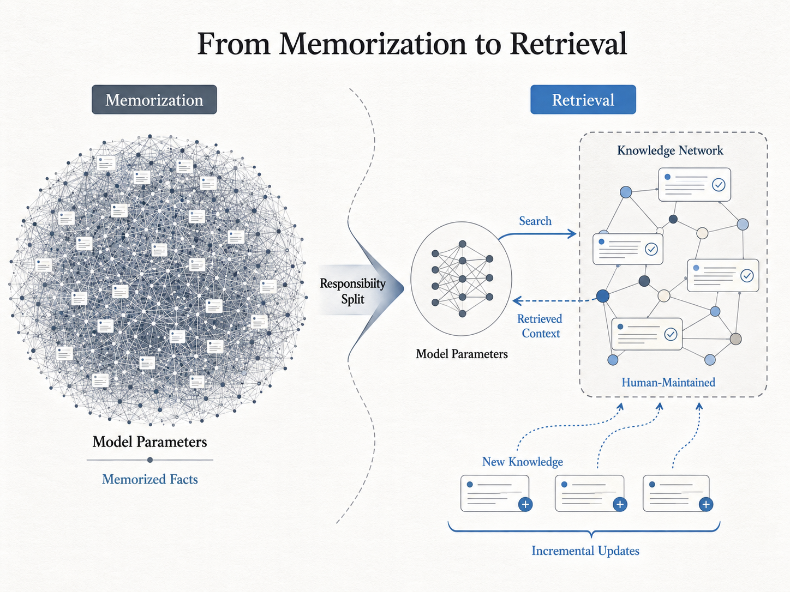
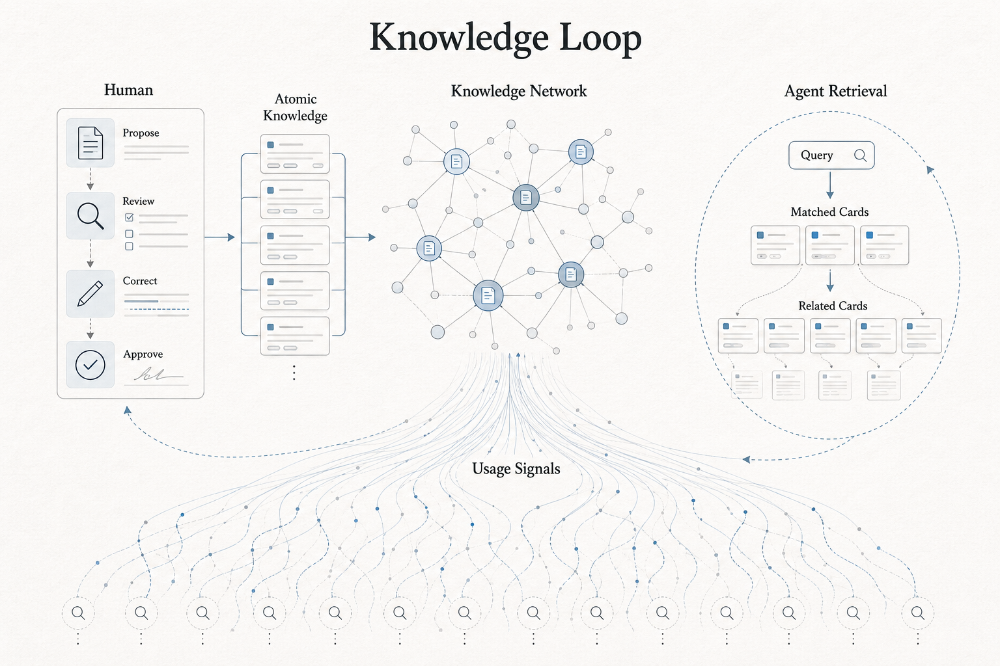

  <h1>Humanity's Last Library</h1>
  
<strong>A human-maintained knowledge network that agents can search, cite, and use.</strong>

  

    <a href="https://knowledge.orbitalis.org">Website</a>
  

Humanity's Last Library is a knowledge infrastructure project for the agent era.
It treats knowledge as an external, reviewable layer rather than something every
model must memorize inside its parameters.

Humans maintain quality upstream: they review, correct, organize, and improve
structured knowledge. Agents use it downstream: they search, retrieve, cite, and
act on relevant context through public retrieval surfaces.

## Why It Exists

Most public knowledge is packaged for human reading: pages, articles, search
results, and documentation sites. Agents can use those sources, but they often
need a different upstream shape: stable units of knowledge, explicit relations,
reviewable maintenance, and retrieval surfaces designed for machine consumption.

This project does not try to build another encyclopedia. It explores whether
knowledge can be represented as a maintained network that agents can consume
through explicit protocols, while humans remain responsible for quality.

## The Bet

Large language models carry a great deal of knowledge inside their parameters.
That has made them powerful, but it also makes knowledge updates expensive,
slow, and hard to inspect.

This project explores a different boundary: what if models did not need to
memorize as much factual knowledge, and instead learned how to find the right
knowledge from an external, maintained network?

This is the shift the project explores: from models memorizing every fact to
agents retrieving from a maintained knowledge layer.

  

If knowledge lives in a network of cards, relations, reviews, and usage signals,
then updating knowledge becomes an incremental operation instead of a full
retraining problem. New facts, corrections, and better structure can be added
directly to the knowledge layer. The model's role can shift from remembering
everything to knowing how to retrieve, judge, and use the right context.

## How It Works

The system is designed as a loop: humans maintain quality upstream, agents
retrieve downstream, and query-path signals can improve retrieval over time.

  

- **Human review:** proposed knowledge changes are reviewed, corrected,
  approved, and applied before they become formal knowledge.
- **Knowledge network:** accepted knowledge is represented as focused cards with
  explicit relationships.
- **Agent retrieval:** agents query the network, inspect matched cards, and
  progressively reveal related context when needed.
- **Query-path signals:** aggregate search paths from many agents can guide
  future retrieval tuning, structure changes, and maintenance priorities.

## What You Can Use Today

- A public web application for browsing, search, account flows, and docs.
- A public remote MCP service with a `search` tool for agent clients.
- Knowledge-card search surfaces designed for downstream agent consumption.
- Initial usage-signal capture for agent searches, so future offline analysis
  can improve retrieval quality and knowledge organization.

## Current Limits

This project does not claim that its first corpus is more original or more
authoritative than the sources it is built from. The initial data is bootstrapped
from Wikipedia-derived material, and much of the card creation process still
depends on AI-assisted extraction.

That is a real limitation. It does not fully match the long-term principle of a
knowledge network maintained by humans.

For now, the project is primarily an architectural experiment: a way to test
whether knowledge can be represented, reviewed, searched, consumed by agents, and
improved through usage signals inside a better system boundary. The bet is not
that the first dataset is special. The bet is that the structure can become
better as humans maintain it and agents use it.

## Documentation

- **Use:** [Website](https://knowledge.orbitalis.org) and
  [product docs](https://knowledge.orbitalis.org/docs).
- **Connect:** [MCP client setup](docs/mcp.md).
- **Build:** [Developer docs](docs/development.md).
- **License:** [Licensing guide](docs/licensing.md).

## Licensing

Software source, configuration, generated contract clients, scripts, and
developer documentation are licensed under the Apache License, Version 2.0.
Knowledge content, source-derived datasets, exported database snapshots, and
archived data artifacts are governed separately by [DATA_LICENSE.md](DATA_LICENSE.md).

## Project Status

Humanity's Last Library is under active development and is being prepared for an
early public release. The current public programmatic surface is the MCP `search`
tool. Private REST APIs, internal pipelines, and data models are still project
implementation details unless documented otherwise.

This is a working hypothesis, not a settled claim. The goal is to make the
assumptions inspectable, discussable, and easier to improve.
